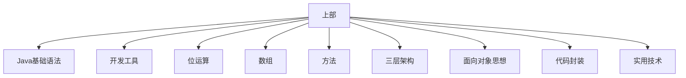
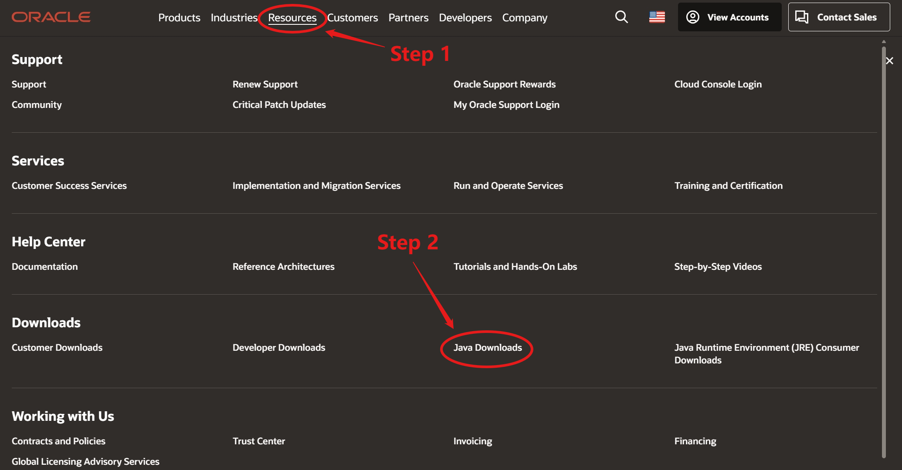
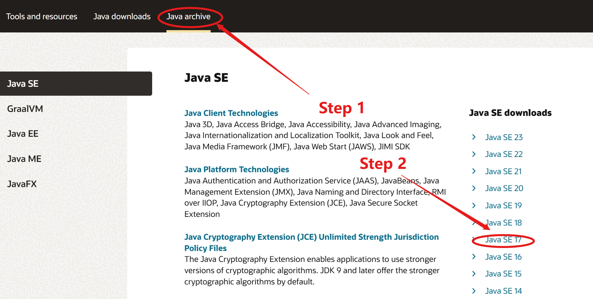
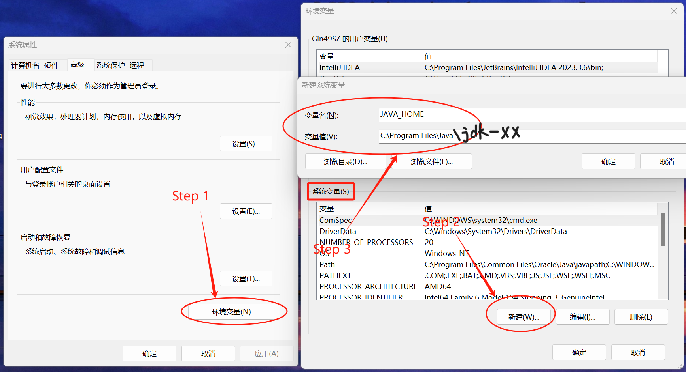
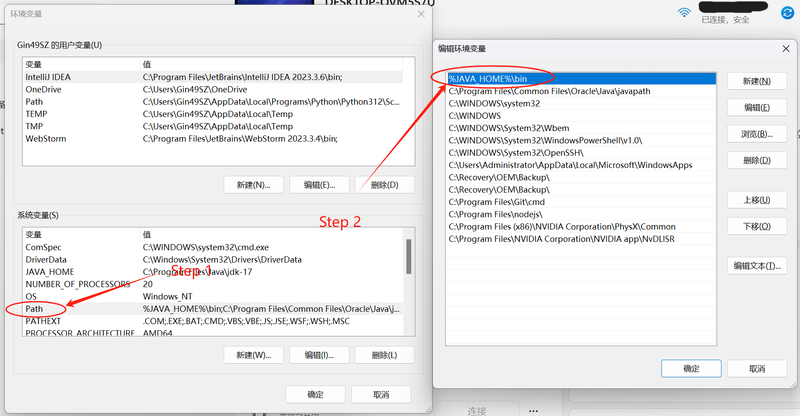
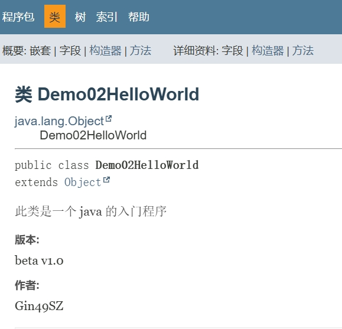

# Java（上部）

## 第 0 章 开篇介绍

[ Java 上部 ] 所包含的内容 



***

## 第 1 章 Java 相关概述

### 1.1 JavaSE 课程体系介绍

1. 第一部分：核心语法内容 - 数据类型、运算符、流程控制、数组、方法
2. 第二部分：面向对象核心逻辑 - 类和对象、封装、继承、多态、抽象、接口
3.  第三部分：JavaSE 核心高级应用 - API、集合、IO 流、多线程、网络编程、反射
4. 第四部分：Java 新特性 - Lambda 表达式、函数式接口、新日期类、jdk8-17 新特性


### 1.2 Java 语言介绍

**语言发展过程**

机器语言 → 汇编语言 → 高级语言

**Java 语言**

- Java 生态圈：CSDN、GitHub、Gitee、APACHE ...
- Java 虚拟器使得任何一种能够被编译成字节码的计算机语言都属于 Java 这个平台
- Java 代表了开源和共享

Java 最适合的领域：服务器端

**JavaSE**

JavaSE (Java Platform, Standard Edition 标准版) 即允许在桌面和服务器上开发和部署的 Java 应用程序

主要学习内容：基本语法内容和语法规范，为 JavaEE 打基础

**JavaEE**

JavaEE (Java Platform, Enterprise Edition 企业版) 即为开发企业环境下的应用程序提供的一套解决方案，主要针对 Web 应用程序的开发

**JavaME**

JavaME (Java Platform, Mobile Edition) 即用于嵌入式和移动设备


### 1.3 软件开发

软件开发是根据用户要求建造出软件系统或者系统中的软件部分的过程

软件开发是一项包括需求==捕捉、需求分析、设计、实现和测试==的系统工程

软件一般是用某种程序设计语言来实现的，通产采用软件开发工具可以进行开发（IDE）

 **Java 开发主要使用的语言**

Java、sql、JS

***

## 第 2 章 Java 入门前言

### 2.1 字节

1. 字节是计算机中存储数据的最小计量单位，用 Byte (B) 表示

   计算机中最小的存储单元是 bit(b) ，1B = 8b

2. 存储数据的计量单位

   8bit = 1Byte

   1024B = 1KB

   1024KB = 1MB

   1024MB = 1GB

   1024GB = 1TB


### 2.2 常用的 DOS 命令

WIN + R 输入 cmd 打开命令窗口

```cmd
C:\Users\X>
```

> C 代表的是盘符
>
> Users 代表的是此盘符下的文件夹
>
> X 代表的是Users 文件夹下的子文件夹
>
> 以上所有构成了==当前操作位置==

**常用命令**

| 命令                                                         | 作用                                                         |
| ------------------------------------------------------------ | ------------------------------------------------------------ |
| `盘符名:` <br />盘符名不区分大小写，但是计算机上必须有对应盘 | 切换盘符                                                     |
| `dir `                                                       | 查看当前路径下的文件或者文件夹                               |
| `cd 文件夹名`                                                | 进入当前目录下的制定文件夹下                                 |
| `cd 路径文件夹名\...\目标文件夹名`                           | 进入指定的多级文件夹下                                       |
| `cd ..`                                                      | 退到上一级文件夹                                             |
| `cd \`                                                       | 退回到根目录                                                 |
| `cls`                                                        | 清屏                                                         |
| `exit`                                                       | 退出终端                                                     |
| `mkdir 文件夹名`                                             | 在当前目录下创建文件夹                                       |
| `mkdir 文件夹名\...\文件夹名`                                | 在当前目录下创建多级文件夹                                   |
| `rd 文件夹名`                                                | 删除文件夹<br />删除的文件夹必须为空，且是直接删除，不进入回收站 |
| `del 文件名.后缀名`                                          | 删除文件<br />也不会进入回收站                               |
| `del *.后缀名`                                               | 删除所有相同后缀名的文件                                     |

***

## 第 3 章 Java 环境

### 3.1 JVM 和跨平台

JVM：Java 虚拟机，是运行程序的假象计算机，主要用来运行 java 程序的

跨平台：Java 代码可以在不同的操作系统上运行（一次编写，到处运行）

 Java 程序通过在不同平台上的不同平台版本 JVM 可以转化为对应的


### 3.2 JDK 和 JRE

JDK (Java Development Kit) ：Java 开发工具包，包含了 JRE

> JDK 包含的内容
>
> 1. javac 编译工具
> 2. java 调试工具
> 3. jhat 内存分析工具
>
> ...   

JRE (Java Runtime Environment) ：java 运行环境，包含了 jvm 以及后面开发用到的核心类库

**JDK、JRE 和 JVM 三者之间的关系**

JDK 包含 JRE，JRE 包含 JVM

因此只需要安装 JDK 即可

> 从 jdk9 开始 jdk 的目录中中就没有单独的 JRE 目录了，因为 JRE 作为一个运行时，不需要包含太多的的东西浪费空间，从而降低运行效率
>
> jdk9 引入木块化技术，让开发者能够按照自己的应用创建一个最小运行时

#### 3.2.1 JDK 的安装

1. 下载官网：www.oracle.com

2. 进入 Java 下载界面：Resources → Java Downloads

   

3. 查询 Java 历史记录：Java archive → Java SE 17

   

4. 下载对应的操作系统版本

5. 安装 → 选择安装路径（安装路径不允许有中文和空格）

> 测试是否安装成功：
>
> 1. 进入对应 jdk 的 bin 路径下，打开 dos 命令窗口
>
>    ```cmd
>    C:\Program Files\Java\jdk-17\bin>
>    ```
>
> 2. 输入命令 `javac` 检测==编译命令==
>
> 3. 输入命令 `java` 检测==运行命令==

#### 3.2.2 环境变量的配置

> 上述检测 javac 和 java 命令的时候，一旦跳出 bin 文件夹，就无法执行，然而实际开发的 java 文件可能并不在 bin 目录下，为了能够在其他文件夹正常运行 java，需要进行环境变量的配置

配置环境变量的目的：在任意路径下都可以随意使用 javac 和 java 命令进行对 java 代码的编译和运行

**方式一：修改环境变量**

1. 在设置中找==高级系统设置==
2. 高级 → 环境变量 → 系统变量：Path → 编辑 → 新建 → 将 bin 文件夹所在路径复制到 Path 中

**方式二：配置 java_home** ⭐

1. 在设置中找==高级系统设置==

2. 高级 → 环境变量：新建 → 设置变量名为 JAVA_HOME，变量值为==bin 所在的目录==

   ```
   变量名: JAVA_HOME
   变量值: C:\Program Files\Java\jdk-17
   ```

   

3. 将 JAVA_HOME 配置到系统 Path 中，配置的路径为 `%JAVA_HOME%\bin` 并置顶

   

> JAVA_HOME 的好处：
>
> 1. 当需要更改 java 的版本的时候，只需要更改 JAVA_HOME 所指向的目录即可
> 2. jdk 安装后自带的环境变量配置可以直接删除
> 3. 如果电脑重启后环境变量失效，进入环境变量，无需做任何事，直接确认即可

***

## 第 4 章 Java 入门程序

### 4.1 开发三步骤

1. 编写
   - 创建一个文本文档，将后缀名改为 `.java`，变成一个 java 文件
   - ==注意==：需要将文件的后缀名显示出来，否则无法修改文件后缀名
2. 编译
   - 命令 `javac 文件名.java`
   - ==注意==：javac 会将 java 文件编译成一个 `.class` 文件（字节码文件），jvm 运行时只认 class 文件
3. 运行
   - 命令 `java 文件名`
   - ==注意==：运行的是 `.class` 文件，且在命令中无需指定后缀名


### 4.2 编写 HelloWorld

**编写**

创建空白文件 `Demo01HelloWorld.java`

使用 Notepad++ 编辑该文件

```java
public class Demo01HelloWorld{
	public static void main(String[] args){
		System.out.println("Hello World");
	}
}
```

**编译**

选中该 java 文件所在的目录，输入 cmd 打开终端，执行 `javac Demo01HelloWord.java`

```cmd
C:\Users\Gin49SZ\Desktop\Study\Java\JavaFiles>javac Demo01HelloWorld.java
```

会产生一个 class 文件 `Demo01HelloWorld.class`

**运行**

在终端执行 `java Demo01HelloWorld` 即可完成运行，即可在终端中输出 Hello World

```cmd
C:\Users\Gin49SZ\Desktop\Study\Java\JavaFiles>java Demo01HelloWorld
Hello World
```


### 4.3 注释

注释是对代码的解释说明，注释一共分成三种

1. 单行注释

   ```java
   // 注释内容
   ```

2. 多行注释

   ```java
   /*
     注释内容
   */
   ```

3. 文档注释

   ```java
   /**
   * 注释内容
   */
   ```

**示例01 注释**

```java
// 单行注释： class 后的名字要与 java 文件名一致
public class Demo01HelloWorld{
	/*
	  多行注释： main 是一个方法，是程序的入口，jvm 运行程序要找 main 方法当作入口执行程序
	*/
	public static void main(String[] args){
		/**
		* 文档注释：
		* 下面的语句是输出语句
		*/
		System.out.println("Hello World");
	}
}
```

**多行注释和文档注释的区别**

当我们给别人一个开发好的类，想让别人快速对我们所写的代码进行了解，应该如何做呢？

==多行注释可以通过 javadoc 命令生成一个 API 文档==，其他人可以通过该文档快速对该类以及类所实现的功能进行快速了解

> javadoc 命令的使用方法：`javadoc -d 要生成的文件夹名字 - author - version 文件名.java` 
>
> **注意：**
>
> 如果在生成 API 文档的时候出现编码格式错误，可以加上 `-encoding 编码类型` 适应文件的编码格式

**示例02 生成 API 文档**

```java
/**
* 此类是一个 java 的入门程序
* @author Gin49SZ
* @version beta v1.0
*/
public class Demo02HelloWorld{
	public static void main(String[] args){
		/**
		* main 是一个方法，是程序的入口
		* jvm 运行程序要找 main 方法当作入口执行程序
		*/
		System.out.println("Hello World");
	}
}
```

```cmd
C:\Users\Gin49SZ\Desktop\Study\Java\JavaFiles>javadoc -encoding UTF-8 -d api -author -version Demo02HelloWorld.java
```

进入对应生成的文档文件夹 → 打开 `index.html` 查看 API 文档





### 4.4 第一个程序的逐行解释含义

```java
/*
	1. public class Demo03HelloWorld 的含义：定义一个类
	2. class 的含义：代表的就是类，类是 java 程序最基本的组成单元，所有代码都需要在类中写
	3. class 后面跟的是类名，类名要求是 java 文件名保持一致
*/
public class Demo03HelloWorld{
	/*
		public static void main(string[] args)
		是 main 方法，是程序的入口
		jvm 执行代码，会从 main 方法开始执行
	*/
	public static void main(String[] args){
		// 打印语句（输出语句），会将我们想要输出的内容打印到控制台上
		System.out.println("Hello World");
	}
}
```

> **注意：**
>
> 1. 类名要和 java 文件名保持一致
>
> 2. 程序中的标点符号必须是英文的
>
>    可以设置为始终以半角方式输入英文符号避免出现符号格式错误


### 4.5 关键字

关键字是 java 提前定义好的，具有特殊含义的小写单词，在高级记事本中有特殊的颜色


### 4.6 编写要注意的问题

#### 4.6.1 字符编码问题

编码和解码的格式要保持一致，编码是 UTF-8 解码也必须是 UTF-8，GBK 编码必须对应 GBK 解码

> GBK 在 Notepad++ 中用 ANSI 表示

==DOS 命令窗口默认为 GBK 格式编码==，因此如果要使用 UTF-8 的 java 文件，要改成 `javac -encoding utf-8 文件名.java` 完成编译

 在 Notepad++ 中选择 设置 → 首选项 → 新建：编码区域 → 选择默认创建文件的编码格式

#### 4.6.2 类名必须和文件名一致？

不一定，但是如果不一致，则不能用 public 声明

```java
class Demo{
}
```

如果 class 前面带有 public，则这个类名必须要与文件名一致

即，一个 java 文件中可以有多个类，但是只能有一个用 public 声明，且==一个文件中有多少个类，就会编译出多少个 class 文件==，且 main 方法必须写在带 public 的类中

因此建议一个文件只写一个 class 且这个 class 带有唯一的 public 和 main 方法

#### 4.6.3 print 和 println 的区别

相同点：都是输出语句

不同点：println 输出后自带换行，而 print 输出后不带换行，但也可以在输出内容中加入 `\n` 手动换行

#### 4.6.4 Notepad 常用快捷键

- 复制当前行：ctrl + d
- 操作多个行：按住 Alt 拉动鼠标

***

## 第 5 章 常量和变量

### 5.1 常量

#### 5.1.1  常量的类型

常量是在代码运行的过程中，值不会发生改变的数据

常量的分类：

- 整数常量：包含所有的整数 - `2`

- 小数常量：包含所有带小数点的 - `2.1`、`2.0`

- 字符常量：带单引号的 `''`，且单引号中只能有一个内容

  `'a'` 是，`aa` 不是

  `' '` 是，`''` 不是，单引号内必须也只能有一个内容

- 字符串常量：带双引号 `""`，双引号内的内容可以有任意个

- 布尔常量：true 真，false 假

- 空常量：null，代表数据不存在 

#### 5.1.2 常量的使用

```java
public class Demo01Constant{
	public static void main(String[] args){
		// 整数常量
		System.out.println(1);
		// 小数常量
		System.out.println(0.1);
		// 字符常量
		System.out.println('a');
		// 字符串常量
		System.out.println("abcd");
        // 布尔常量
        System.out.println(false);
        // 空常量不能直接使用
	}
}
```

#### 5.1.3 常量的运算

除号两侧有一个是小数，结果也为小数

除号两侧均为整数，结果一定为整数，且向下取整


### 5.2 变量

#### 5.1.1 变量的类型

变量是在代码运行的过程中，值会随着不同的情况而随时发生改变的数据

| 数据类型     | 关键字  | 内存占用 | 取值范围       |
| ------------ | ------- | -------- | -------------- |
| 字节型       | byte    | 1 个字节 | -128 ~ 127     |
| 短整型       | short   | 2 个字节 | -32768 ~ 32767 |
| 整形         | int     | 4 个字节 | -              |
| 长整型       | long    | 8 个字节 | -              |
| 单精度浮点数 | float   | 4 个字节 | -              |
| 双精度浮点数 | double  | 8 个字节 | -              |
| 字符型       | char    | 2 个字节 | -              |
| 布尔类型     | boolean | 1 个字节 | true, false    |

> 引用数据类型：类、数组、接口、枚举、注解


